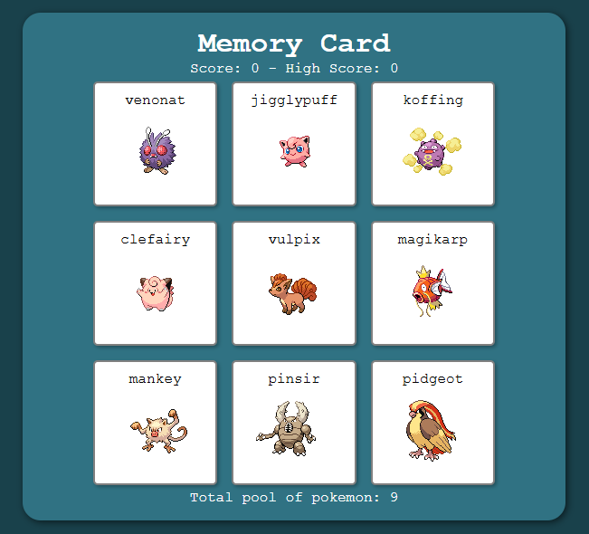

# Pokémon Memory Card

A React memory card game built with Vite. The player is shown a grid of Pokémon cards and must click each Pokémon only once. After every click, the cards are shuffled. Clicking a Pokémon that has already been selected resets the current score, while the high score is preserved.

**Live site:** https://nickwortho-memorycard.netlify.app/ \
**Repository:** https://github.com/nickwortho/memory-card

## Screenshots

<kbd>

</kbd>

## Features

- Random Pokémon data fetched from the [PokéAPI](https://pokeapi.co/)
- Card grid displaying Pokémon names and sprites
- Cards shuffle after every selection
- Current score tracking
- High score tracking
- Duplicate-card selection resets the round
- Loading state while Pokémon data is being fetched
- Randomised Pokémon pool from the original 151 Pokémon
- Built with React state and component-based UI

## Built With

- React
- Vite
- JavaScript
- CSS
- PokéAPI
- ESLint

## How to Play

1. Wait for the Pokémon cards to load.
2. Click a Pokémon card to gain a point.
3. After each click, the displayed cards are shuffled from the total pool.
4. Keep clicking Pokémon you have not selected yet.
5. If you click the same Pokémon twice in one round, your current score resets.
6. Try to beat your high score.

## Getting Started

To run the project locally on Windows:

```bash
git clone https://github.com/nickwortho/memory-card.git
cd memory-card
npm install
npm run dev
```

Then open the local development URL shown in your terminal, usually something like:

```txt
http://localhost:5173/
```

## Available Scripts

Start the Vite development server:

```bash
npm run dev
```

Build the app for production:

```bash
npm run build
```

Preview the production build locally:

```bash
npm run preview
```

Run ESLint across the project:

```bash
npm run lint
```


## Credits

Pokémon data and sprites are provided by [PokéAPI](https://pokeapi.co/).
